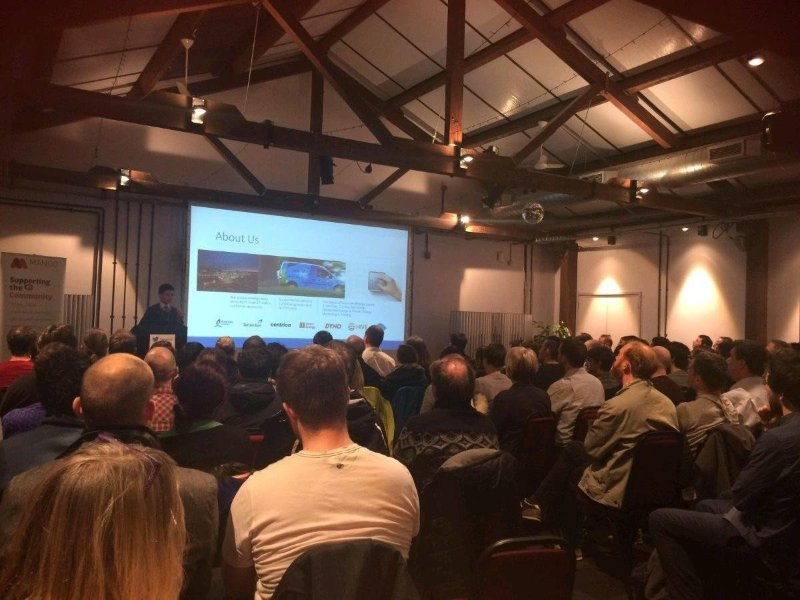

Deep learning models can be used to extract representations for multidimensional time series data. We have used a sensors dataset collected from an industrial-scale compresssor unit to illustrate this problem. Real-values sensor signals were treated as multidimensional time series and fed through a recurrent auto-encoder model. Representations extracted can be projected to low dimensionity space and reflect temporal behaviour of the underlying time series. Specific signals can be isolated for detailed analysis using partial reconstruction of the original input.

Slides can be downloaded [here](../files/bristol.pdf).