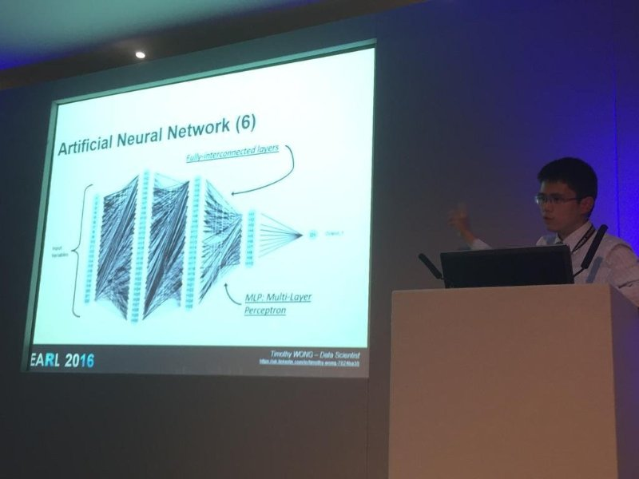

The ability to foresee what’s about to happen is crucial to the success of energy companies like Centrica. For instance, predicting the number of boiler breakdown on any given day allows us to ensure sufficient number of gas engineers to be staffed.

Traditionally, these time series problems can be handled by decomposing the data into different components. Such method can be adapted and integrated with Recurrent Neural Nets (RNN) to produce better results through deep learning. Furthermore, model accuracy can vary under different conditions and an additional layer of aggregation can be performed to ameliorate such problem.

Slides can be downloaded [here](../files/earl2016.pdf).