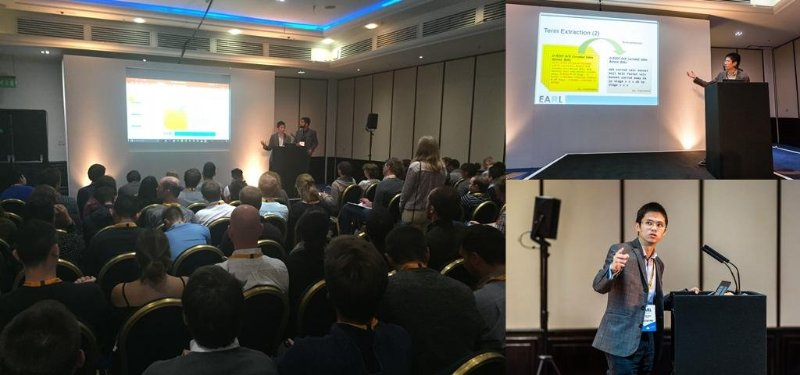

Centrica plc is an energy service company and its Exploration and Production (E&P) division currently operates several gas production assets across the world. A largescale production asset usually contains thousands of components which require regular inspection and maintenance. Understanding the pattern of component failure is the key to manage large-scale assets successfully.

Component issues identified in regular inspection are recorded in the repair log as description text. Traditionally engineers would pick up the issue one-by-one and carry out further investigation accordingly. We used the repair log dataset and applied text mining techniques to highlight vulnerable components and their associated risks. A wide range of text mining techniques were used, including the tf-idf scheme and pairwise correlation. The analysis output is produced as network graphs which visualises vulnerable components as a dense blob. Alternatively, dimensionality reduction techniques such as t-SNE can be used to produce similar results.

Slides can be downloaded (here)[../files/earl2017.pdf].