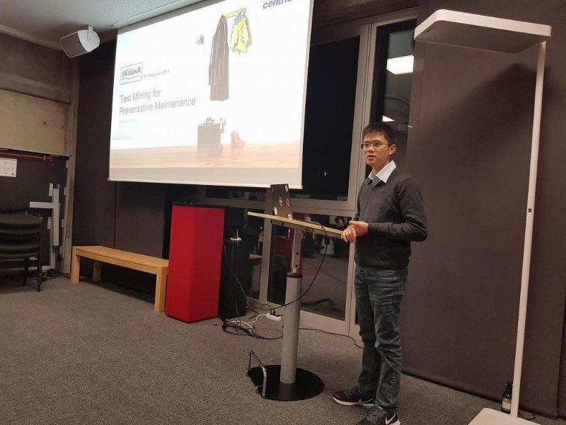

Large-scale industrial processes are normally comprised of thousands and thousands of individual components which are vulnerable to breakdown. Maintenance of these components is the key to reduce unplanned outages. The repair log dataset contains unstructured, free-format text description detailing the issues. We applied text mining algorithms to this dataset and turned it into an analysable format. A combination of techniques were used including tf-idf scheme and n-grams approach. Groups of vulnerable components can be visualised as a graph network.

Slides can be downloaded (here)[../files/koln.pdf].